# Anydesk Config

## ⚠️ Download following apps 
|Downloads|Images|
|---|---|
|1. Download Latest Anydesk||
|2. Download Notification Open App Manager  |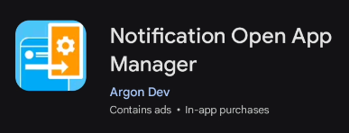| 

## Steps to configure anydesk 

### 1. Open Anydesk and allow notification  
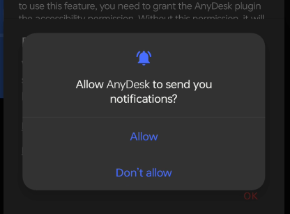

### 2. Accept the plugin activation  

### 3. Click on Anydesk Control Service AD1
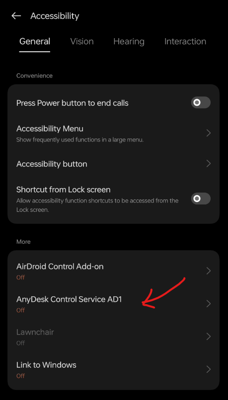

### 4. Turn on AnyDesk Control Service AD1 and go back 

### 5. Click on three dot on top left in Anydesk 

### 6. Click on settings

### 7. Click on Security
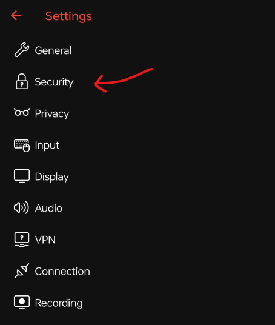

### 8. Click on Permission Profiles 
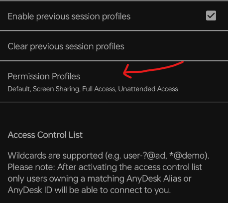

### 9. Click on Unattainded Access
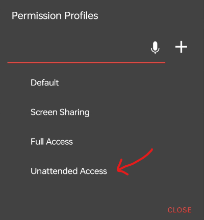

### 9. Enable the profile 
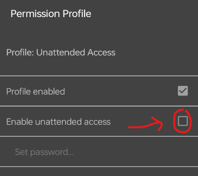

### 9. Click on Set Password
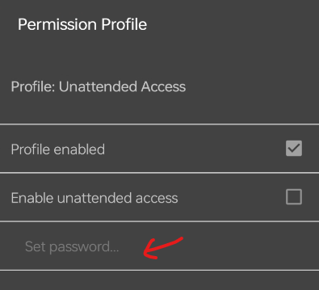

### 10. Add a password and click ok
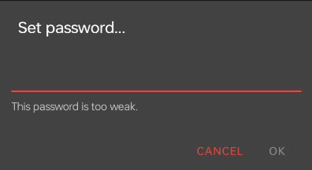

### 11. Scroll down and set timeout to 999 or higher
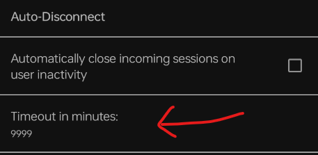

### 12. In miscellaneous section turn this setting on
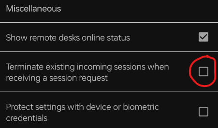

## Step to configure Notification Open App Manager

### 1. Open Notification Open App Manager

### 2. Click on Enable Permission
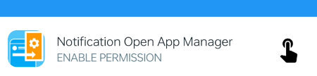

### 3. Click on Notification Open App Manager and enable it and go back 
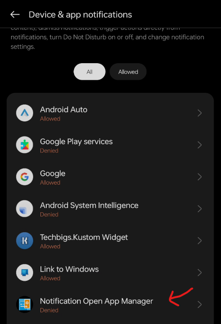

### 4. Click on next 
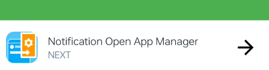

### 5. Click on Enable Permission
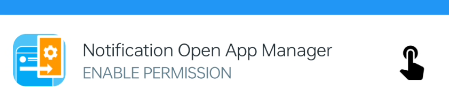

### 6. Click on Notification Open App Manager and enable it 
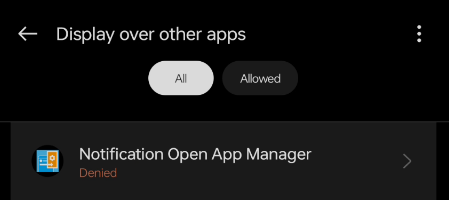

### 7. Click on next 

### 8. Click on check
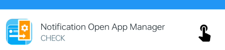

### 9. Click on Manage Notification and enable it
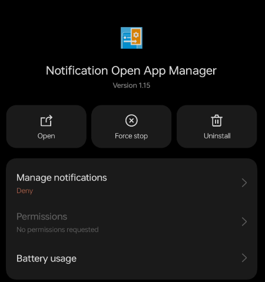

### 10. Go back and click on + button on top right
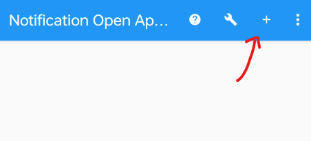

### 11. Click on ? and click on anydesk 
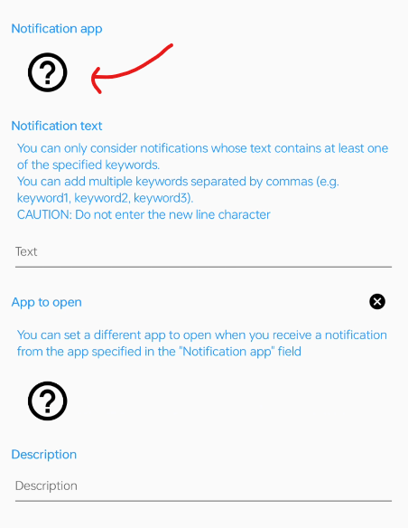  
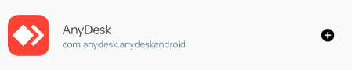

### 12. Click on text and type 
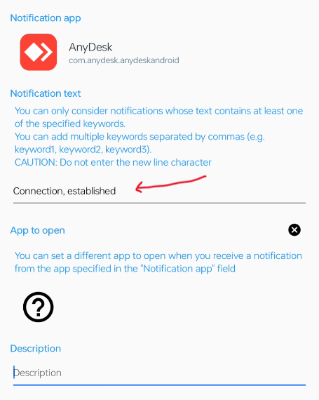

### 13. Click on ? and select anydesk
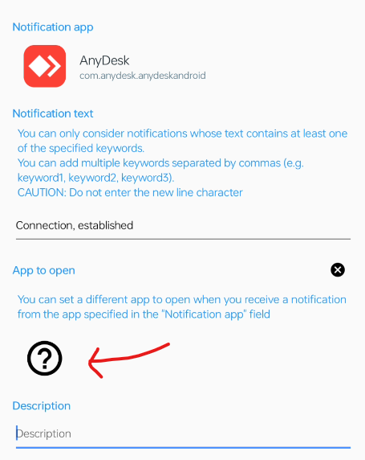  

### 14. Click on save on top right
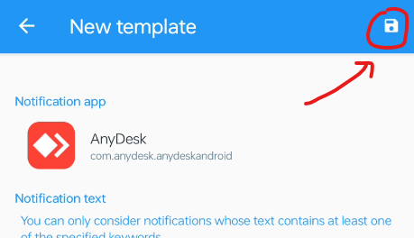

## Other settings 

### 1. Disable permission monitoring in Developer Options
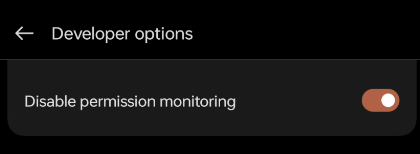

### 2. Turn off all the animation in Developer Options
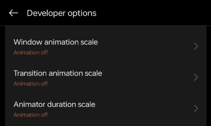

